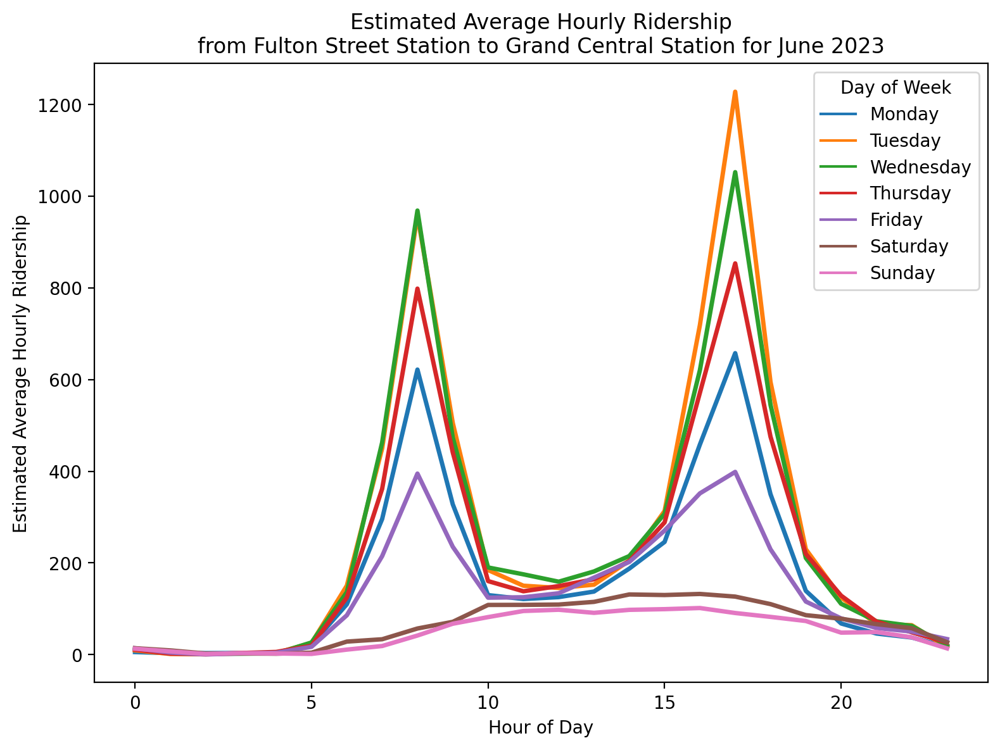
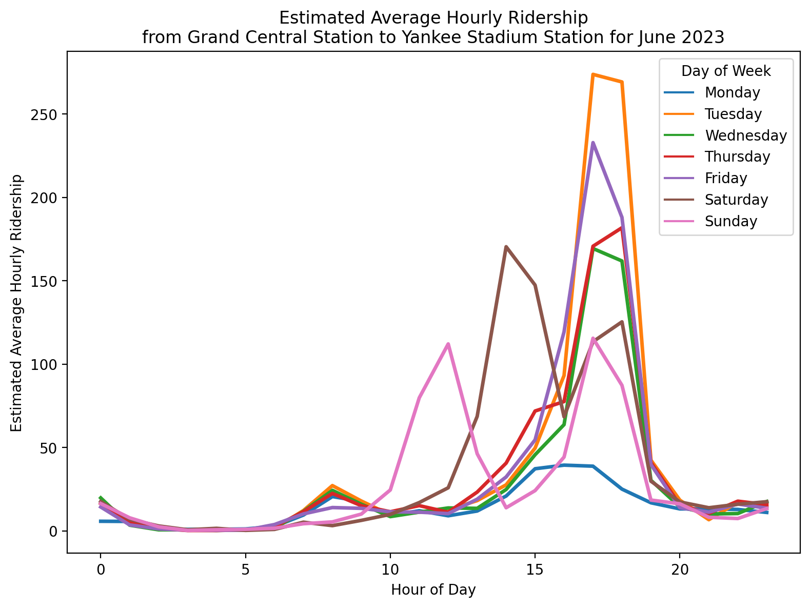

# MTA Subway Origin-Destination Ridership Estimate: 2023

Author: Mark Bauer

Note: Duplicate destination stations are dropped for the purpose of this figure (i.e. the highest hourly average per station is selected). Because the dataset is aggregated by day of week and hour of day over a calendar month, it is possible to have the same destination station with different hourly averages in the top 20. Same applies to the figure below. Please refer to the [subway-trips notebook](https://github.com/mebauer/mta-data/blob/main/subway-trips.ipynb) for more information. 

# 1. Introduction
Brief description about the dataset from the data dictionary:
>This dataset provides an estimate of subway travel patterns based on scaled-up OMNY and MetroCard
return tap and swipe data for 2023. It will provide estimated passenger volumes for all populated origindestination (OD) pairs aggregated by month, day of the week, and hour of day. It also provides the
name, ID, and approximate latitude and longitude of the origin and destination subway complexes.

Additionally, the MTA wrote an article introducing the dataset that I've found useful and informative. In particular, how the dataset is aggregated. For example: **The format of this aggregated dataset allows users to understand for “an average 9 a.m. hour during the month of May,” roughly how many people travelled between two subway complexes.**
> **About the data**  
Let’s talk a bit more about the data. This dataset is based off of the ‘Destination Inference’ step of our ridership model, which we detailed in a [previous blog post](https://new.mta.info/article/where-everybody-subway-going). As that post outlines, the basis of this model is the assumption that a subway trip’s destination is the station the rider next swipes/taps at. If a MetroCard swipes into Bowling Green at 9:15 a.m., and then that same MetroCard swipes into the 103 St stop in East Harlem later that afternoon, we make the imperfect (but pretty good) inference that this 9:15 a.m. trip traveled from Bowling Green to 103 St. These “linked trips” are what form the basis of our understanding of how riders travel across the system (Note 1).
>
>In this Subway Origin-Destination (OD) dataset, we’ve taken these assigned destinations generated by our destination inference process and aggregated them by origin-destination station complex pair and hour of day. These totals are then further aggregated by averaging over a calendar month. Removing personally identifying information, like MetroCard ID numbers, and aggregating ridership data over a calendar month is done to protect the privacy of MTA riders by preventing the association of a single MetroCard swipe or subway trip to a specific person or hour. The format of this aggregated dataset allows users to understand for “an average 9 a.m. hour during the month of May,” roughly how many people travelled between two subway complexes.
>
>It’s important to keep a few things in mind when using this data: 
>
>Because this data is the result of a modeling process, the ridership numbers for each origin-destination pair are estimates, not exact values. This modeling process, as well as the monthly aggregation, results in fractional ridership values—we’ve intentionally left ridership estimates as decimals to reflect the uncertainty inherent in this dataset. 
Because this data represents a monthly average, users should be mindful that holidays, construction, or other important events that take place during a given month might impact ridership estimates. 
Since the modeling process only looks at subway station entries, we can’t quantify how many of these trips truly started and ended at these subway station complexes and how many may have included a transfer from or to another mode of transit (e.g. a bus) at either or both ends. 
When using the data to look at arrivals to a subway station, users should note that the timestamp for each OD pair is rounded down to the nearest hour of the entry swipe (or tap) and does not account for the travel time between the entry swipe and arrival at the destination (Note 2).

Source: [Introducing the Subway Origin-Destination Ridership dataset](https://new.mta.info/article/introducing-subway-origin-destination-ridership-dataset)

# 2. Code 
- The code to produce the figures is located in the [subway-trips.ipynb](https://github.com/mebauer/mta-data/blob/main/subway-trips.ipynb) notebook.
- The [data-exporter.py](https://github.com/mebauer/mta-data/blob/main/data-exporter.py) Python file demonstrates how to export the data. 

# 3. Data
The *MTA Subway Origin-Destination Ridership Estimate: 2023* data was retrieved from the [New York Open Data Portal](https://data.ny.gov/Transportation/MTA-Subway-Origin-Destination-Ridership-Estimate-2/uhf3-t34z/about_data).

# 4. Say Hello!
Feel free to reach out.
- LinkedIn: [markebauer](https://www.linkedin.com/in/markebauer/)   
- Portfolio: [mebauer.github.io](https://mebauer.github.io/)
- GitHub: [mebauer](https://github.com/mebauer)