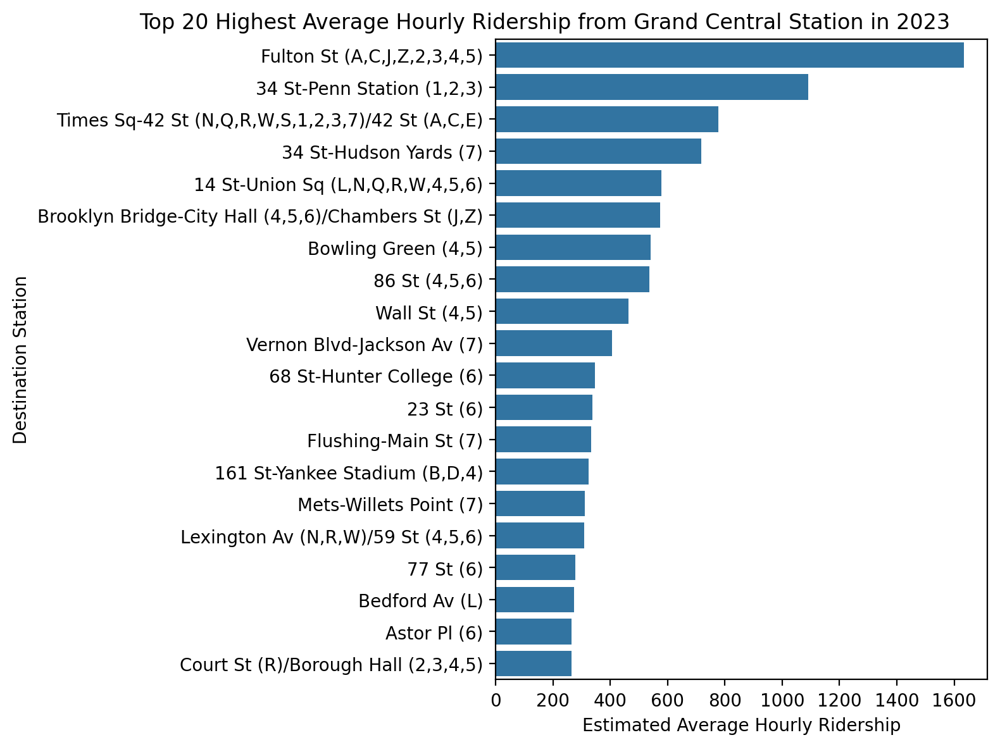
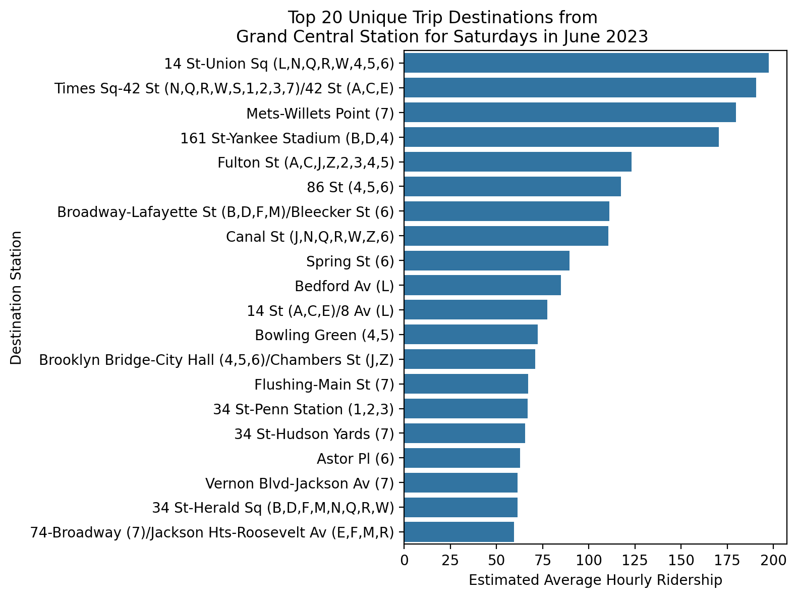
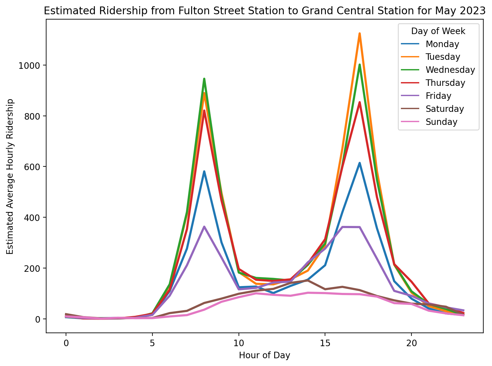
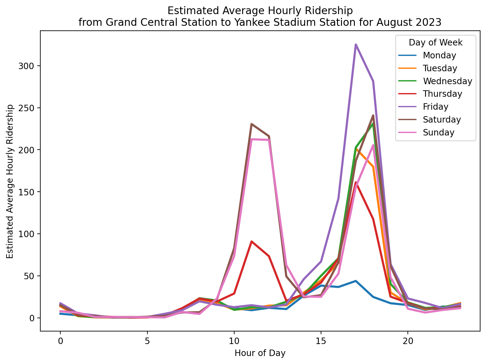

# MTA Subway Origin-Destination Ridership Estimate: 2023

Author: Mark Bauer

# 1. Introduction

# 2. Code 
- The code to produce the figures is located in the [subway-trips.ipynb](https://github.com/mebauer/mta-data/blob/main/subway-trips.ipynb) notebook.
- The [data-exporter.py](https://github.com/mebauer/mta-data/blob/main/data-exporter.py) Python file contains the code to export the data. 

# 3. Data
The *MTA Subway Origin-Destination Ridership Estimate: 2023* data was retrieved from the [New York Open Data Portal](https://data.ny.gov/Transportation/MTA-Subway-Origin-Destination-Ridership-Estimate-2/uhf3-t34z/about_data).

# 4. Say Hello!
Feel free to reach out.
- LinkedIn: [markebauer](https://www.linkedin.com/in/markebauer/)   
- Portfolio: [mebauer.github.io](https://mebauer.github.io/)
- GitHub: [mebauer](https://github.com/mebauer)