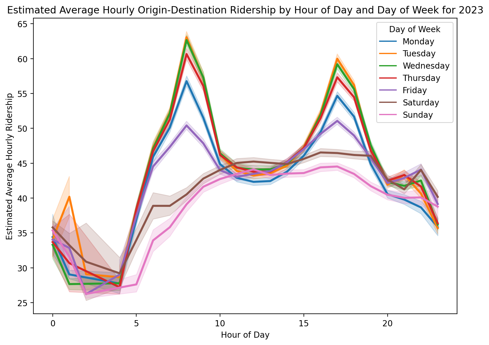
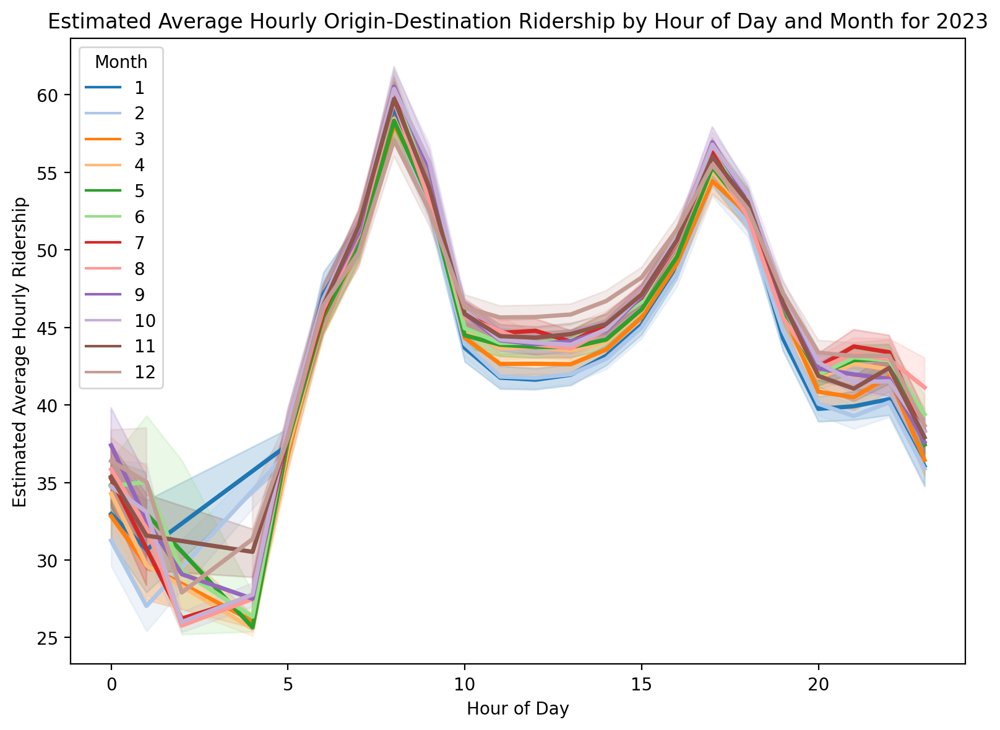
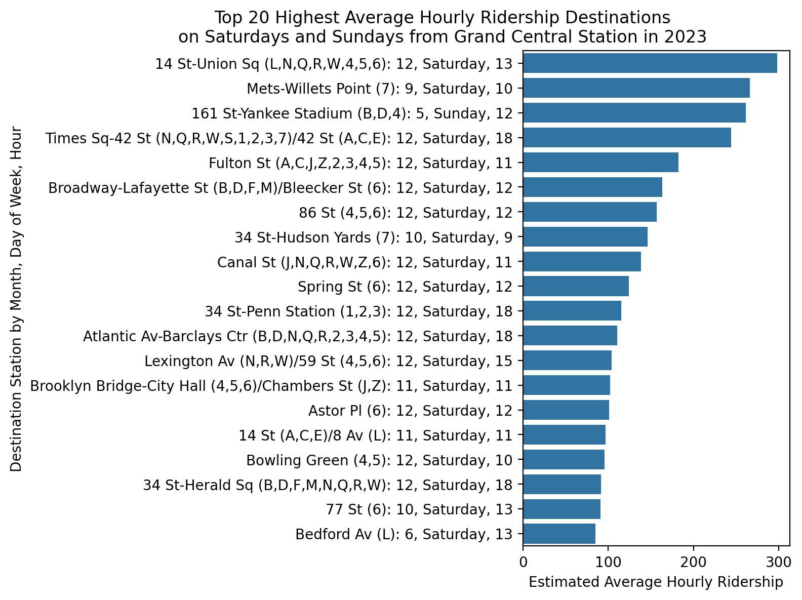
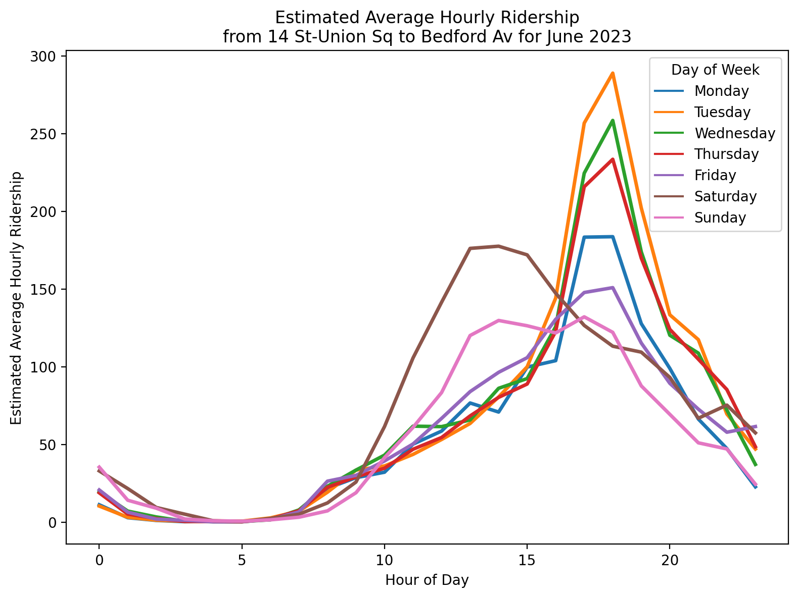

# MTA Subway Origin-Destination Ridership Estimate 2023
Author: Mark Bauer

# Table of Contents

   * [1. Introduction](#1-Introduction)
   * [2. Code](#2-Code)
   * [3. Data](#3-Data)
   * [4. Say Hello!](#4-Say-Hello)
   * [5. Appendix: Tables](#5-Appendix-Tables)
   
## Peak Travel Times and Trends

Figure xx: Estimated Average Hourly Ridership by Hour of Day and Day of Week for 2023. The figure displays the average hourly ridership across all trips and months. The error bands represent the 95% confidence interval, illustrating the variability in estimated ridership. Hourly ridership values below 25 have been excluded from the display.

Figure xx: Estimated Average Hourly Ridership by Hour of Day and Weekday/Weekend for 2023. The figure displays the average hourly ridership across all trips, months and days of the week. The error bands represent the 95% confidence interval, illustrating the variability in estimated ridership. Hourly ridership values below 25 have been excluded from the display.

Figure xx: Estimated Average Hourly Ridership by Hour of Day and Month for 2023. The figure displays the average hourly ridership across all trips and days of the week. The error bands represent the 95% confidence interval, illustrating the variability in estimated ridership. Hourly ridership values below 25 have been excluded from the display.

## Origin-Destination Pair Analysis

Figure xx: Top 20 Highest Average Hourly Ridership Destinations from the Grand Central Station in 2023. Note: The highest value per destination was selected.

Figure xx: Top 20 Highest Average Hourly Ridership Destinations on Saturdays and Sundays from Grand Central Station in 2023. Note: The highest value per destination was selected.

Figure xx: Estimated Average Hourly Ridership from Grand Central Station to Fulton Street Station for June 2023.

Figure xx: Estimated Average Hourly Ridership from Grand Central Station to Yakee Stadium Stadium for June 2023.

Figure xx: Estimated Average Hourly Ridership from 14 St-Union Sq to Bedford Av Williamsburg for June 2023.

# 1. Introduction
Brief description about the dataset from the data dictionary:
>This dataset provides an estimate of subway travel patterns based on scaled-up OMNY and MetroCard
return tap and swipe data for 2023. It will provide estimated passenger volumes for all populated origindestination (OD) pairs aggregated by month, day of the week, and hour of day. It also provides the
name, ID, and approximate latitude and longitude of the origin and destination subway complexes.

Additionally, the MTA wrote an article introducing the dataset that I've found useful and informative. In particular, how the dataset is aggregated. For example: **The format of this aggregated dataset allows users to understand for “an average 9 a.m. hour during the month of May,” roughly how many people travelled between two subway complexes.**
> **About the data**  
Let’s talk a bit more about the data. This dataset is based off of the ‘Destination Inference’ step of our ridership model, which we detailed in a [previous blog post](https://new.mta.info/article/where-everybody-subway-going). As that post outlines, the basis of this model is the assumption that a subway trip’s destination is the station the rider next swipes/taps at. If a MetroCard swipes into Bowling Green at 9:15 a.m., and then that same MetroCard swipes into the 103 St stop in East Harlem later that afternoon, we make the imperfect (but pretty good) inference that this 9:15 a.m. trip traveled from Bowling Green to 103 St. These “linked trips” are what form the basis of our understanding of how riders travel across the system (Note 1).
>
>In this Subway Origin-Destination (OD) dataset, we’ve taken these assigned destinations generated by our destination inference process and aggregated them by origin-destination station complex pair and hour of day. These totals are then further aggregated by averaging over a calendar month. Removing personally identifying information, like MetroCard ID numbers, and aggregating ridership data over a calendar month is done to protect the privacy of MTA riders by preventing the association of a single MetroCard swipe or subway trip to a specific person or hour. The format of this aggregated dataset allows users to understand for “an average 9 a.m. hour during the month of May,” roughly how many people travelled between two subway complexes.
>
>It’s important to keep a few things in mind when using this data: 
>
>Because this data is the result of a modeling process, the ridership numbers for each origin-destination pair are estimates, not exact values. This modeling process, as well as the monthly aggregation, results in fractional ridership values—we’ve intentionally left ridership estimates as decimals to reflect the uncertainty inherent in this dataset. 
Because this data represents a monthly average, users should be mindful that holidays, construction, or other important events that take place during a given month might impact ridership estimates. 
Since the modeling process only looks at subway station entries, we can’t quantify how many of these trips truly started and ended at these subway station complexes and how many may have included a transfer from or to another mode of transit (e.g. a bus) at either or both ends. 
When using the data to look at arrivals to a subway station, users should note that the timestamp for each OD pair is rounded down to the nearest hour of the entry swipe (or tap) and does not account for the travel time between the entry swipe and arrival at the destination (Note 2).

Source: [Introducing the Subway Origin-Destination Ridership dataset](https://new.mta.info/article/introducing-subway-origin-destination-ridership-dataset)

# 2. Code 
- The code to produce the figures is located in the [subway-trips.ipynb](https://github.com/mebauer/mta-data/blob/main/subway-trips.ipynb) notebook.
- The [data-exporter.py](https://github.com/mebauer/mta-data/blob/main/data-exporter.py) Python file demonstrates how to export the data. 

# 3. Data
The *MTA Subway Origin-Destination Ridership Estimate: 2023* data was retrieved from the [New York Open Data Portal](https://data.ny.gov/Transportation/MTA-Subway-Origin-Destination-Ridership-Estimate-2/uhf3-t34z/about_data).

# 4. Say Hello!
Feel free to reach out.
- LinkedIn: [markebauer](https://www.linkedin.com/in/markebauer/)   
- Portfolio: [mebauer.github.io](https://mebauer.github.io/)
- GitHub: [mebauer](https://github.com/mebauer)

# 5. Appendix: Tables

| origin_station_complex_name     | destination_station_complex_name   |   estimated_average_ridership |   month | day_of_week   |   hour_of_day |
|:--------------------------------|:-----------------------------------|------------------------------:|--------:|:--------------|--------------:|
| Grand Central-42 St (S,4,5,6,7) | Fulton St (A,C,J,Z,2,3,4,5)        |                       1634.14 |       9 | Tuesday       |             8 |
| Grand Central-42 St (S,4,5,6,7) | Fulton St (A,C,J,Z,2,3,4,5)        |                       1611    |       9 | Wednesday     |             8 |
| Grand Central-42 St (S,4,5,6,7) | Fulton St (A,C,J,Z,2,3,4,5)        |                       1562.5  |      10 | Wednesday     |             8 |
| Grand Central-42 St (S,4,5,6,7) | Fulton St (A,C,J,Z,2,3,4,5)        |                       1535.44 |      10 | Tuesday       |             8 |
| Grand Central-42 St (S,4,5,6,7) | Fulton St (A,C,J,Z,2,3,4,5)        |                       1480.53 |       6 | Tuesday       |             8 |
| Grand Central-42 St (S,4,5,6,7) | Fulton St (A,C,J,Z,2,3,4,5)        |                       1466.44 |       7 | Wednesday     |             8 |
| Grand Central-42 St (S,4,5,6,7) | Fulton St (A,C,J,Z,2,3,4,5)        |                       1456.59 |       6 | Wednesday     |             8 |
| Grand Central-42 St (S,4,5,6,7) | Fulton St (A,C,J,Z,2,3,4,5)        |                       1456.32 |       5 | Tuesday       |             8 |
| Grand Central-42 St (S,4,5,6,7) | Fulton St (A,C,J,Z,2,3,4,5)        |                       1444.68 |       8 | Tuesday       |             8 |
| Grand Central-42 St (S,4,5,6,7) | Fulton St (A,C,J,Z,2,3,4,5)        |                       1444.02 |      11 | Tuesday       |             8 |
| Grand Central-42 St (S,4,5,6,7) | Fulton St (A,C,J,Z,2,3,4,5)        |                       1438.31 |       5 | Wednesday     |             8 |
| 34 St-Penn Station (A,C,E)      | 5 Av/53 St (E,M)                   |                       1437.02 |       1 | Tuesday       |             8 |
| Grand Central-42 St (S,4,5,6,7) | Fulton St (A,C,J,Z,2,3,4,5)        |                       1404.19 |       3 | Wednesday     |             8 |
| Grand Central-42 St (S,4,5,6,7) | Fulton St (A,C,J,Z,2,3,4,5)        |                       1393.56 |       4 | Tuesday       |             8 |
| Grand Central-42 St (S,4,5,6,7) | Fulton St (A,C,J,Z,2,3,4,5)        |                       1367.46 |       9 | Thursday      |             8 |
| Grand Central-42 St (S,4,5,6,7) | Fulton St (A,C,J,Z,2,3,4,5)        |                       1348.3  |      10 | Thursday      |             8 |
| Fulton St (A,C,J,Z,2,3,4,5)     | Grand Central-42 St (S,4,5,6,7)    |                       1343.42 |       9 | Tuesday       |            17 |
| Grand Central-42 St (S,4,5,6,7) | Fulton St (A,C,J,Z,2,3,4,5)        |                       1334.8  |      11 | Wednesday     |             8 |
| Grand Central-42 St (S,4,5,6,7) | Fulton St (A,C,J,Z,2,3,4,5)        |                       1328.39 |       1 | Tuesday       |             8 |
| Grand Central-42 St (S,4,5,6,7) | Fulton St (A,C,J,Z,2,3,4,5)        |                       1324.13 |       8 | Wednesday     |             8 |

Table xx: Top 20 Highest Estimated Average Hourly Ridership for 2023. Most of these trips are from Grand Central Station to Fulton Street Station on Tuesdays and Wednesdays at 8AM.

| origin_station_complex_name                      | destination_station_complex_name                 |   estimated_average_ridership |   month | day_of_week   |   hour_of_day |
|:-------------------------------------------------|:-------------------------------------------------|------------------------------:|--------:|:--------------|--------------:|
| 161 St-Yankee Stadium (B,D,4)                    | Times Sq-42 St (N,Q,R,W,S,1,2,3,7)/42 St (A,C,E) |                       355.574 |       5 | Sunday        |            16 |
| Times Sq-42 St (N,Q,R,W,S,1,2,3,7)/42 St (A,C,E) | 14 St-Union Sq (L,N,Q,R,W,4,5,6)                 |                       322.311 |      12 | Saturday      |            16 |
| 161 St-Yankee Stadium (B,D,4)                    | Grand Central-42 St (S,4,5,6,7)                  |                       311.788 |       8 | Saturday      |            23 |
| 161 St-Yankee Stadium (B,D,4)                    | Times Sq-42 St (N,Q,R,W,S,1,2,3,7)/42 St (A,C,E) |                       307.082 |       8 | Sunday        |            17 |
| Grand Central-42 St (S,4,5,6,7)                  | 14 St-Union Sq (L,N,Q,R,W,4,5,6)                 |                       297.767 |      12 | Saturday      |            13 |
| 161 St-Yankee Stadium (B,D,4)                    | Grand Central-42 St (S,4,5,6,7)                  |                       293.471 |       8 | Saturday      |            15 |
| 14 St-Union Sq (L,N,Q,R,W,4,5,6)                 | Bedford Av (L)                                   |                       291.528 |       4 | Saturday      |            15 |
| 14 St-Union Sq (L,N,Q,R,W,4,5,6)                 | Bedford Av (L)                                   |                       291.373 |       4 | Saturday      |            14 |
| Grand Central-42 St (S,4,5,6,7)                  | 14 St-Union Sq (L,N,Q,R,W,4,5,6)                 |                       290.865 |      12 | Saturday      |            12 |
| 161 St-Yankee Stadium (B,D,4)                    | Grand Central-42 St (S,4,5,6,7)                  |                       286.185 |       5 | Sunday        |            16 |
| 161 St-Yankee Stadium (B,D,4)                    | Times Sq-42 St (N,Q,R,W,S,1,2,3,7)/42 St (A,C,E) |                       285.73  |       4 | Sunday        |            16 |
| 14 St-Union Sq (L,N,Q,R,W,4,5,6)                 | Bedford Av (L)                                   |                       282.76  |       4 | Saturday      |            13 |
| Grand Central-42 St (S,4,5,6,7)                  | 14 St-Union Sq (L,N,Q,R,W,4,5,6)                 |                       281.962 |      12 | Saturday      |            14 |
| Grand Central-42 St (S,4,5,6,7)                  | 14 St-Union Sq (L,N,Q,R,W,4,5,6)                 |                       281.092 |      12 | Saturday      |            17 |
| WTC Cortlandt (1)                                | Times Sq-42 St (N,Q,R,W,S,1,2,3,7)/42 St (A,C,E) |                       278.544 |      12 | Saturday      |            17 |
| Grand Central-42 St (S,4,5,6,7)                  | 14 St-Union Sq (L,N,Q,R,W,4,5,6)                 |                       274.554 |      12 | Saturday      |            11 |
| 34 St-Herald Sq (B,D,F,M,N,Q,R,W)                | 161 St-Yankee Stadium (B,D,4)                    |                       273.866 |       4 | Sunday        |            12 |
| 14 St-Union Sq (L,N,Q,R,W,4,5,6)                 | Times Sq-42 St (N,Q,R,W,S,1,2,3,7)/42 St (A,C,E) |                       273.861 |      12 | Saturday      |            15 |
| 14 St-Union Sq (L,N,Q,R,W,4,5,6)                 | Grand Central-42 St (S,4,5,6,7)                  |                       272.715 |      12 | Saturday      |            16 |
| 161 St-Yankee Stadium (B,D,4)                    | Times Sq-42 St (N,Q,R,W,S,1,2,3,7)/42 St (A,C,E) |                       269.068 |       8 | Saturday      |            15 |

Table xx. Top 20 Highest Estimated Average Hourly Ridership on Saturdays and Sundays for 2023. A significant portion of the highest ridership figures can be attributed to Yankees games at 161st St-Yankee Stadium.

|   month | origin_station_complex_name     | destination_station_complex_name   |   estimated_average_ridership | day_of_week   |   hour_of_day |
|--------:|:--------------------------------|:-----------------------------------|------------------------------:|:--------------|--------------:|
|       1 | 34 St-Penn Station (A,C,E)      | 5 Av/53 St (E,M)                   |                       1437.02 | Tuesday       |             8 |
|       2 | Grand Central-42 St (S,4,5,6,7) | Fulton St (A,C,J,Z,2,3,4,5)        |                       1281.41 | Wednesday     |             8 |
|       3 | Grand Central-42 St (S,4,5,6,7) | Fulton St (A,C,J,Z,2,3,4,5)        |                       1404.19 | Wednesday     |             8 |
|       4 | Grand Central-42 St (S,4,5,6,7) | Fulton St (A,C,J,Z,2,3,4,5)        |                       1393.56 | Tuesday       |             8 |
|       5 | Grand Central-42 St (S,4,5,6,7) | Fulton St (A,C,J,Z,2,3,4,5)        |                       1456.32 | Tuesday       |             8 |
|       6 | Grand Central-42 St (S,4,5,6,7) | Fulton St (A,C,J,Z,2,3,4,5)        |                       1480.53 | Tuesday       |             8 |
|       7 | Grand Central-42 St (S,4,5,6,7) | Fulton St (A,C,J,Z,2,3,4,5)        |                       1466.44 | Wednesday     |             8 |
|       8 | Grand Central-42 St (S,4,5,6,7) | Fulton St (A,C,J,Z,2,3,4,5)        |                       1444.68 | Tuesday       |             8 |
|       9 | Grand Central-42 St (S,4,5,6,7) | Fulton St (A,C,J,Z,2,3,4,5)        |                       1634.14 | Tuesday       |             8 |
|      10 | Grand Central-42 St (S,4,5,6,7) | Fulton St (A,C,J,Z,2,3,4,5)        |                       1562.5  | Wednesday     |             8 |
|      11 | Grand Central-42 St (S,4,5,6,7) | Fulton St (A,C,J,Z,2,3,4,5)        |                       1444.02 | Tuesday       |             8 |
|      12 | Grand Central-42 St (S,4,5,6,7) | Fulton St (A,C,J,Z,2,3,4,5)        |                       1130.8  | Tuesday       |             8 |

Table xx. Highest Estimated Average Hourly Ridership per Month for 2023. With the exception of January, where the route from 34th Street Penn Station to 5th Avenue/53rd Street ranks first, all other months show the highest ridership on the route from Grand Central Station to Fulton Street Station.

| day_of_week   | origin_station_complex_name                      | destination_station_complex_name                 |   estimated_average_ridership |   month |   hour_of_day |
|:--------------|:-------------------------------------------------|:-------------------------------------------------|------------------------------:|--------:|--------------:|
| Monday        | Grand Central-42 St (S,4,5,6,7)                  | Fulton St (A,C,J,Z,2,3,4,5)                      |                       942.466 |      11 |             8 |
| Tuesday       | Grand Central-42 St (S,4,5,6,7)                  | Fulton St (A,C,J,Z,2,3,4,5)                      |                      1634.14  |       9 |             8 |
| Wednesday     | Grand Central-42 St (S,4,5,6,7)                  | Fulton St (A,C,J,Z,2,3,4,5)                      |                      1611     |       9 |             8 |
| Thursday      | Grand Central-42 St (S,4,5,6,7)                  | Fulton St (A,C,J,Z,2,3,4,5)                      |                      1367.46  |       9 |             8 |
| Friday        | 161 St-Yankee Stadium (B,D,4)                    | Times Sq-42 St (N,Q,R,W,S,1,2,3,7)/42 St (A,C,E) |                       524.801 |       7 |            21 |
| Saturday      | Times Sq-42 St (N,Q,R,W,S,1,2,3,7)/42 St (A,C,E) | 14 St-Union Sq (L,N,Q,R,W,4,5,6)                 |                       322.311 |      12 |            16 |
| Sunday        | 161 St-Yankee Stadium (B,D,4)                    | Times Sq-42 St (N,Q,R,W,S,1,2,3,7)/42 St (A,C,E) |                       355.574 |       5 |            16 |

Table xx. Highest Estimated Average Hourly Ridership per Day of Week for 2023.

|   hour_of_day | origin_station_complex_name                      | destination_station_complex_name                        |   estimated_average_ridership |   month | day_of_week   |
|--------------:|:-------------------------------------------------|:--------------------------------------------------------|------------------------------:|--------:|:--------------|
|             0 | Mets-Willets Point (7)                           | Grand Central-42 St (S,4,5,6,7)                         |                      110.957  |       9 | Sunday        |
|             1 | Mets-Willets Point (7)                           | Flushing-Main St (7)                                    |                       80.0948 |       6 | Saturday      |
|             2 | W 4 St-Wash Sq (A,C,E,B,D,F,M)                   | Times Sq-42 St (N,Q,R,W,S,1,2,3,7)/42 St (A,C,E)        |                       36.4235 |       6 | Saturday      |
|             3 | Times Sq-42 St (N,Q,R,W,S,1,2,3,7)/42 St (A,C,E) | 74-Broadway (7)/Jackson Hts-Roosevelt Av (E,F,M,R)      |                       17.2865 |       9 | Sunday        |
|             4 | 103 St-Corona Plaza (7)                          | 74-Broadway (7)/Jackson Hts-Roosevelt Av (E,F,M,R)      |                       48.3472 |      12 | Friday        |
|             5 | Times Sq-42 St (N,Q,R,W,S,1,2,3,7)/42 St (A,C,E) | Chambers St (A,C)/WTC (E)/Park Pl (2,3)/Cortlandt (R,W) |                       99.473  |      12 | Wednesday     |
|             6 | 34 St-Penn Station (1,2,3)                       | Grand Central-42 St (S,4,5,6,7)                         |                      329.086  |       1 | Tuesday       |
|             7 | Grand Central-42 St (S,4,5,6,7)                  | Fulton St (A,C,J,Z,2,3,4,5)                             |                      902.171  |      10 | Tuesday       |
|             8 | Grand Central-42 St (S,4,5,6,7)                  | Fulton St (A,C,J,Z,2,3,4,5)                             |                     1634.14   |       9 | Tuesday       |
|             9 | Grand Central-42 St (S,4,5,6,7)                  | Fulton St (A,C,J,Z,2,3,4,5)                             |                      735.489  |      10 | Tuesday       |
|            10 | Grand Central-42 St (S,4,5,6,7)                  | Fulton St (A,C,J,Z,2,3,4,5)                             |                      286.447  |      10 | Thursday      |
|            11 | Grand Central-42 St (S,4,5,6,7)                  | 14 St-Union Sq (L,N,Q,R,W,4,5,6)                        |                      274.554  |      12 | Saturday      |
|            12 | Grand Central-42 St (S,4,5,6,7)                  | 14 St-Union Sq (L,N,Q,R,W,4,5,6)                        |                      290.865  |      12 | Saturday      |
|            13 | Grand Central-42 St (S,4,5,6,7)                  | 14 St-Union Sq (L,N,Q,R,W,4,5,6)                        |                      297.767  |      12 | Saturday      |
|            14 | 14 St-Union Sq (L,N,Q,R,W,4,5,6)                 | Bedford Av (L)                                          |                      291.373  |       4 | Saturday      |
|            15 | Fulton St (A,C,J,Z,2,3,4,5)                      | Grand Central-42 St (S,4,5,6,7)                         |                      349.491  |      10 | Thursday      |
|            16 | Fulton St (A,C,J,Z,2,3,4,5)                      | Grand Central-42 St (S,4,5,6,7)                         |                      779.982  |       9 | Tuesday       |
|            17 | Fulton St (A,C,J,Z,2,3,4,5)                      | Grand Central-42 St (S,4,5,6,7)                         |                     1343.42   |       9 | Tuesday       |
|            18 | Fulton St (A,C,J,Z,2,3,4,5)                      | Grand Central-42 St (S,4,5,6,7)                         |                      640.239  |       9 | Tuesday       |
|            19 | Grand Central-42 St (S,4,5,6,7)                  | 14 St-Union Sq (L,N,Q,R,W,4,5,6)                        |                      311.075  |      10 | Tuesday       |
|            20 | Flushing-Main St (7)                             | 103 St-Corona Plaza (7)                                 |                      213.404  |       5 | Friday        |
|            21 | 161 St-Yankee Stadium (B,D,4)                    | Times Sq-42 St (N,Q,R,W,S,1,2,3,7)/42 St (A,C,E)        |                      524.801  |       7 | Friday        |
|            22 | 161 St-Yankee Stadium (B,D,4)                    | Times Sq-42 St (N,Q,R,W,S,1,2,3,7)/42 St (A,C,E)        |                      374.555  |       8 | Friday        |
|            23 | 161 St-Yankee Stadium (B,D,4)                    | Grand Central-42 St (S,4,5,6,7)                         |                      311.788  |       8 | Saturday      |

Table xx. Highest Estimated Average Hourly Ridership per Hour of Day for 2023.

